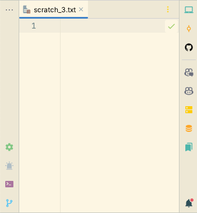

# Uses

## IDE

### PHPStorm

Plugins:
- .env files support
- Atom Material Icons
- GitLink
- GitToolBox
- Key Promoter X
- PHP Annotations
- PHP Inspections (EA Extended)
- Pokemon Trainer Progress Bar
- Rainbow Brackets
- Solarized Themes
- String Manipulation
- Symfony Support
- AceJump

Theme:
- Solarized ligth

Font:
- JetBrains Mono
- Size 14.0
- Line Height 1.3

Windows organization:
